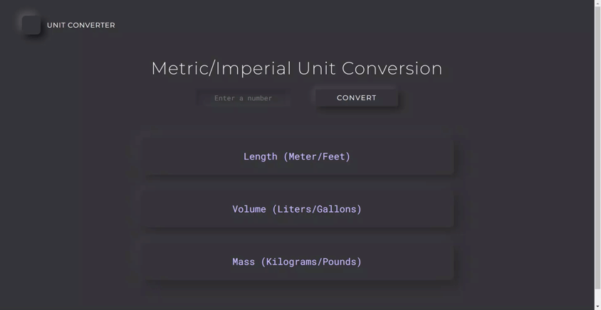

# Unit Converter App
A simple Vanilla JavaScript app that converts any number into different metric and imperial units for Length, Volume, and Mass, and displays all conversions in one go.

## Table of contents
- [Overview](#overview)
  - [Description](#description)
  - [Features](#features)
  - [Demo](#demo)
  - [Links](#links)
- [Built with](#built-with)
- [Installation](#installation)
- [Usage](#usage)
- [Author](#author)
## Overview
### Description
Unit Converter App is a simple and easy to use application that offers a solution to the problem of converting length, volume, and mass units from metric to imperial or vice versa. It was built using Vanilla Javascript, making it lightweight and fast. With this app, you can easily convert any number you want, and the app will show all of the conversions at once.

## Features 
- Convert any number you want from metric to imperial or vice versa.
- A simple "convert" button to start the conversion process
- Three different categories for conversion: length, volume and mass.
- Show all of the conversions at once for length, volume, and mass

### Demo

### Links

- Solution URL: [Github](https://github.com/fatima-xs/unit-converter-app)
- Live Site URL: [Netlify](https://unit-converter-app-fatima.netlify.app/)

## Built with
 
 
 

## Installation
- Download the application from the repository.
- Open the index.html file in a browser.
- Start converting!
    
## Usage
- Type the number you want to convert in the input field
- Click on the "convert" button
- The app will show all of the conversions at once for length, volume, and mass.

## Author
**Fatimata Ndiaye**

